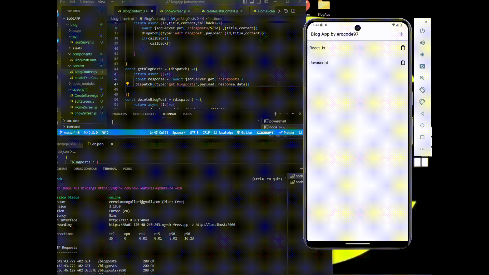

<h1>🚀 Excited to share my latest project: a BlogApp! 📝<h1>

Here's a quick rundown of the steps I followed:

-->Project Initialization and Navigation Setup: Setting up the project structure and navigation.  
-->Context Creation and Integration: Using Context API for state management.  
-->Component Development: Building various components with useState and useReducer.  
-->Design Implementation: Crafting the UI with CSS.  
-->Blog CRUD Operations: Implementing create, read, update, and delete functionalities.  
-->Axios and API Integration: Fetching data from a server using Axios.  

